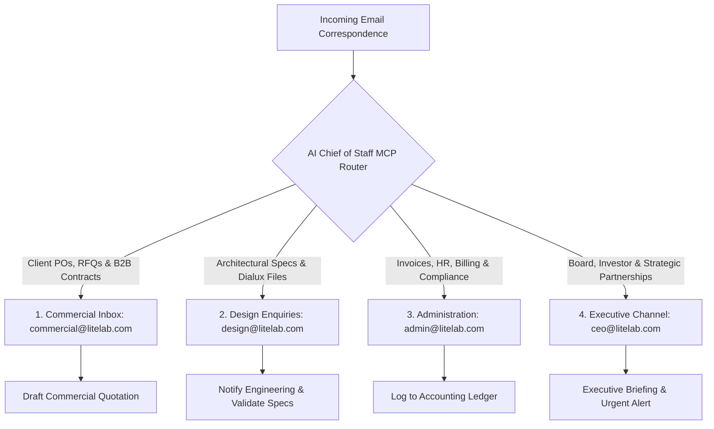

# LiteLab Inbox Management System: Executive AI Chief of Staff 📬

<div align="center">

[](https://modelcontextprotocol.io/)
[](https://www.zoho.com/mail/)
[](#)
[](#)

**Autonomous Model Context Protocol (MCP) Workspace Orchestrating Executive Email Operations Across 4 Dedicated Enterprise Zoho Mail Channels.**

</div>

---

## 📖 Overview

The **LiteLab Mailbox System** is an autonomous AI operational hub configured as a **Model Context Protocol (MCP)** workspace. Serving as the **Executive AI Chief of Staff** for LiteLab, it provides zero-latency automated routing, priority triage, intelligent draft preparation, and thread summarization across multiple corporate email addresses.

Rather than funneling all inquiries into a single chaotic inbox, the architecture enforces strict domain segregation across 4 dedicated Zoho Mail accounts with granular access policies.

---

## 🏛️ 4-Inbox Enterprise Architecture



### Channel Definitions
1. **Commercial Channel (`commercial@`)**: Handles client sales inquiries, Bill of Quantities (BOQ), distributor pricing, and purchase orders.
2. **Design Enquiry Channel (`design@`)**: Dedicated to lighting designers, architects, photometric requests, and IES/LDT file transfers.
3. **Administration Channel (`admin@`)**: Handles accounts payable/receivable, vendor verification, tax compliance, and office logistics.
4. **Executive Channel (`ceo@`)**: Confidential board correspondence, high-value contracts, and key investor communications.

---

## 🌟 Key Capabilities

- 🤖 **Autonomous Contextual Triage**: Inspects incoming message metadata and email bodies to route requests to the responsible channel without human intervention.
- 📝 **Executive Draft Synthesis**: Generates draft responses calibrated to LiteLab's brand voice—professional, concise, and technically rigorous.
- 🛡️ **Zero Credential Leakage**: Sanitized configuration templates (`.env.example`, `.agents/mcp_config.json.example`) keep sensitive passwords and App Tokens isolated from version control.
- 💻 **Portability Engine**: Includes standardized migration instructions (`ceo_setup_instructions.md.example`) allowing rapid deployment across executive laptops.

---

## 📂 Repository Layout

```
litelabmailbox/
├── .agents/
│   └── mcp_config.json.example       # Template configuration for MCP clients (Claude, Antigravity)
├── agent_instructions.md             # Core system prompt & decision rules for AI Chief of Staff
├── ceo_setup_instructions.md.example # Step-by-step setup manual for executive workstations
├── .env.example                      # Template for IMAP/SMTP credentials
├── .gitignore                        # Git exclusion rules for secrets and tokens
└── README.md                         # Project documentation
```

---

## 🚀 Setup & Installation

### Step 1: Clone Repository
```bash
git clone https://github.com/A-Generative-Slice/litelabmailbox.git
cd litelabmailbox
```

### Step 2: Configure Local Credentials
Copy the example configuration templates:
```bash
# On Linux / macOS
cp .env.example .env
cp .agents/mcp_config.json.example .agents/mcp_config.json

# On Windows PowerShell
Copy-Item .env.example .env
Copy-Item .agents\mcp_config.json.example .agents\mcp_config.json
```

Generate **Application-Specific Passwords** inside Zoho Accounts Security Settings for each of the four mail accounts and input them into `.env` and `.agents/mcp_config.json`.

### Step 3: Connect to MCP Client

For **Claude Desktop** (`claude_desktop_config.json`) or **Antigravity**, import the configuration:

```json
{
  "mcpServers": {
    "litelab-mail": {
      "command": "npx",
      "args": ["-y", "@modelcontextprotocol/server-imap"],
      "env": {
        "IMAP_HOST": "imappro.zoho.com",
        "IMAP_PORT": "993"
      }
    }
  }
}
```

---

## 📄 License & Attribution

Designed and engineered by **A Generative Slice** for **LiteLab**.  
Copyright © 2026 LiteLab & A Generative Slice. All rights reserved.
